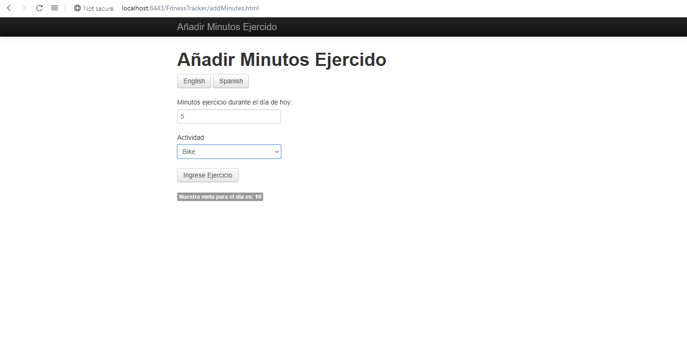

Requirements to run:
- Java 7
- Maven 3+
- Tomcat: v7.0.961
- MySQL:
    - MySQL Server v5.7.28
    - MySQL Workbench v8.0.18
    - ConnectorJ v8.0.18

This project was created by following the "Spring Security Fundamentals" course on PluralSight.
    
This is an expansion of the [FitnessTracker](https://github.com/DominikZig/FitnessTracker) application, adding security through the Spring Security framework.

**Functionality:**

This project allows you to track your fitness goals by entering a goal in minutes. You can then enter how many minutes you exercised for today and which activity you did (out of a choice of running, biking or swimming).
In order to perform these tasks, you must be logged in to the system. Also, only Admin users can add Goals.

**Technical Info:**

The project uses Java (specifically Spring Framework, Spring MVC, Spring JDBC and Spring Security) and MySQL (or LDAP) for backend and JSP/HTML, Bootstrap and jQuery for frontend. It follows a Model View Controller architecture as well as 
having a Service tier for business logic. Maven is used for dependency management, Tomcat is used as the application server and MySQL is used as the relational database for persistence.

The frontend is displayed through JSP/HTML and Bootstrap and the backend consists of heavy use of Spring Security for authentication and authorization and Spring JDBC to interact with the MySQL database. The project also has some advanced features, such as localisation (having Spanish language support), 
validation (both for user input and database structure) and logging.

Spring Security is used extensively to authenticate and authorise users in the system. All users have to login and there are two main roles (User and Admin) to authorise a user to be able to access different parts
of the system. Other security measures are also used such as user permissions, password hashing/encrypting and utilising HTTPS throughout the system. LDAP can also be used for authentication and authorisation instead of requiring a MySQL database.

**Setup:**

In addition to requiring the prerequisite technologies above, there is some setup involved to run the application.

In order to setup MySQL authentication, You must manually setup a Schema first (e.g. named "fitnesstrackersecurity").
Then, run/follow the SQL queries found in springSecuritySQLCommands.sql

To use LDAP authentication instead of MySQL, you need to use       
```xml
<dependency>
    <groupId>org.slf4j</groupId>
    <artifactId>slf4j-simple</artifactId>
    <version>1.5.6</version>
</dependency>
```
instead of 
```xml   
<dependency>
          <groupId>org.slf4j</groupId>
          <artifactId>slf4j-log4j12</artifactId>
          <version>1.7.26</version>
      </dependency>
```

and also add these dependencies:
```xml
      <dependency>
          <groupId>org.apache.directory.server</groupId>
          <artifactId>apacheds-all</artifactId>
          <version>1.5.5</version>
      </dependency>
      <dependency>
          <groupId>org.springframework.security</groupId>
          <artifactId>spring-security-ldap</artifactId>
          <version>3.2.3.RELEASE</version>
      </dependency>
```

in the POM file.

You also must also follow the instructions and comments in security-config.xml


To perform HTTPS cert generation, run:

```shell script
C:\Program Files\Java\jdk1.7.0_80\bin>keytool -genkey -alias tomcat -keyalg RSA
-keystore C:\Dev\Software\apache-tomcat-7.0.96\apache-tomcat-7.0.96\bin\tomcat
```

then under the Tomcat conf directory (i.e. C:\Dev\Software\apache-tomcat-7.0.96\apache-tomcat-7.0.96\conf), modify server.xml as follows:
    <!-- Define a SSL HTTP/1.1 Connector on port 8443
         This connector uses the BIO implementation that requires the JSSE
         style configuration. When using the APR/native implementation, the
         OpenSSL style configuration is required as described in the APR/native
         documentation -->

    <Connector port="8443" protocol="org.apache.coyote.http11.Http11Protocol"
               maxThreads="150" SSLEnabled="true" scheme="https" secure="true"
               clientAuth="false" sslProtocol="TLS" 
               keystoreFile="C:\Dev\Software\apache-tomcat-7.0.96\apache-tomcat-7.0.96\bin\tomcat"
               keystorePassword="changeit"
               />


**Screenshots:**

Login page:


Home page:


Add Goal page:


Add Minutes page:


Logout page:


Unauthorized (403 Error) example:


Validation examples:


Localisation example:


